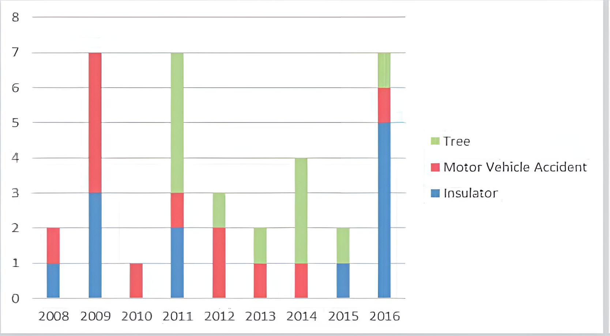

# Project Description

Five substations (EB, OF, RL, TM, and HD) serve a region in Central New York State, north of the City of X. These substations face reliability and capacity issues, and are powered by a single XYZ kV line starting in the City of M, running through Y Park, and following State Route ABC until it terminates at R Lake.

## Power Delivery and Backup

Each substation powers customers in its region, including five different hospitals—one per substation. Each hospital has teams of surgeons performing critical surgeries. During power outages, hospitals rely on backup generators, but their capacities are limited. If repairs are delayed, hospitals may run out of power. The backup power capacity (CAP) for each hospital varies and is a parameter in the program.

## Power Outages

The substations experience outages due to line reliability and capacity issues, compounded by their proximity to Y Park along State Route ABC. Motor vehicle accidents and tree trimming cause frequent outages. The causes of outages from 2008 to 2016 are shown in Figure 1, and the interruption characteristics for the substations are outlined in Table I.

**Figure I: Outages Characteristics**

**Table I: Interruption Characteristics**

| Substation | Total Interruptions | # Customers Interrupted | Customer Hour Interruptions |
| ---------- | ------------------- | ----------------------- | --------------------------- |
| EB         | 27                  | 5,769                   | 16,224                      |
| OF         | 22                  | 4,413                   | 12,780                      |
| HD         | 18                  | 5,990                   | 12,621                      |
| TM         | 16                  | 3,436                   | 11,415                      |
| RL         | 12                  | 3,529                   | 11,980                      |

## Repair Crews and Ticketing System

Crews addressing power outages survey the area and produce tickets, such as the one shown in Figure 2. Each ticket logs the issue's time, address, and nature, and is updated as repairs progress. The program must manage these tickets by adding, updating, and displaying information, as well as identifying similar outages and frequent terms in comments.

---

# Project Instructions

The C++ program will improve the reliability of the substations and hospitals by managing data and implementing optimizations. The program will:

### 1. Ticket Database Management

- Add and update tickets for power outages.
- Display tickets for specific outages and within time ranges.
- Identify the most similar previous tickets at the same or other substations.
- Display frequent terms from outage tickets.

### 2. Surgeon Team Database Management

- Add and remove surgeon teams from hospitals.
- Manage surgeons and surgeries, tracking performance and ranking teams by average points per hour.
- Display surgeries performed within specified periods.

### 3. Power Distribution Optimization

Predict the energy required by surgery teams during outages and optimize the distribution of backup power to maximize efficiency. Use historical data to estimate energy needs and surgery performance.

### 4. Customer Hour Interruptions Minimization

Minimize total customer hour interruptions by allocating repair crews efficiently. The program must also reduce hospital outage times, giving priority to hospitals with high-performing surgery teams.

### 5. Future Outage Prediction

Use historical data (Figure 1) to predict the nature of outages for the next year, and calculate the expected impact on surgery teams and customers.
